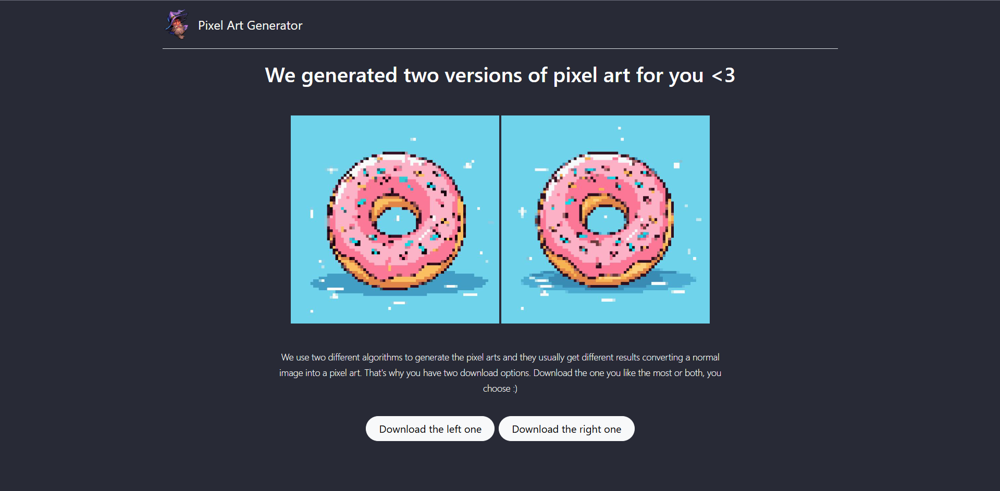
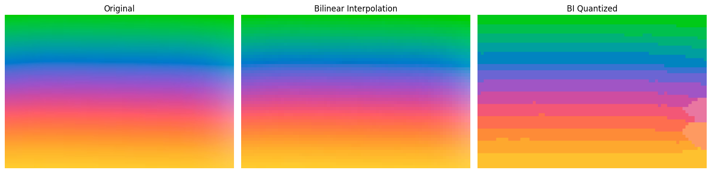
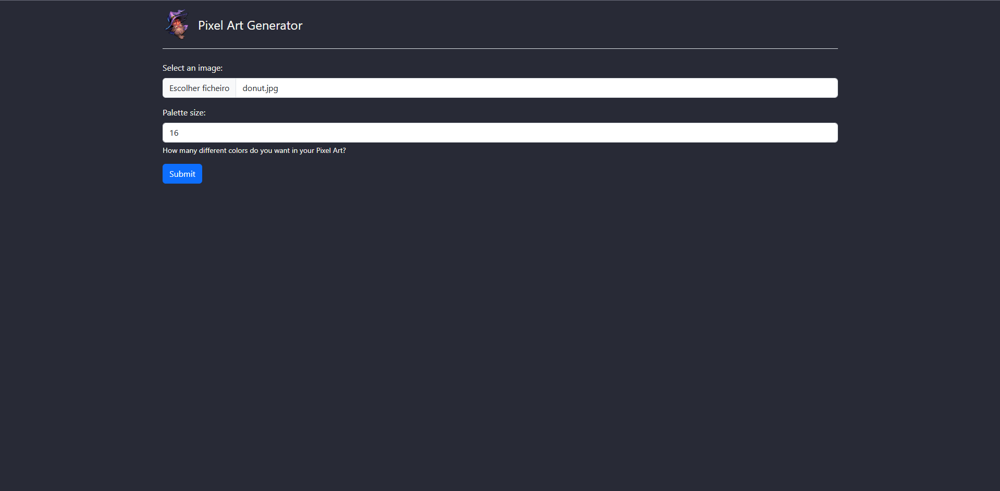
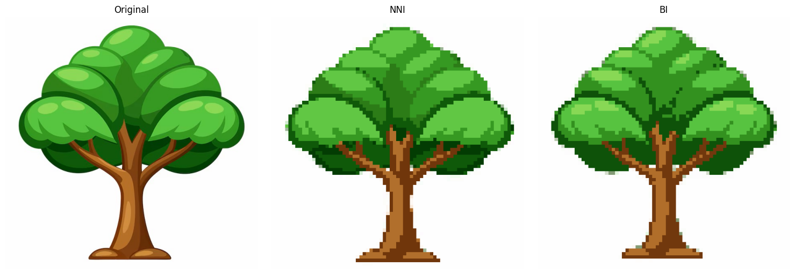
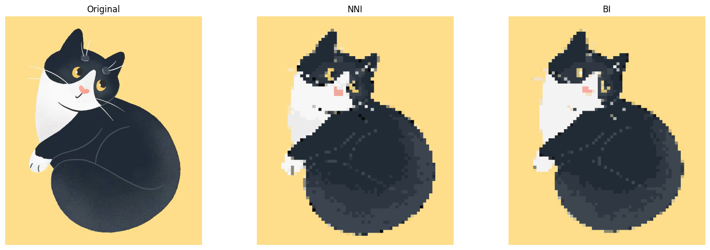
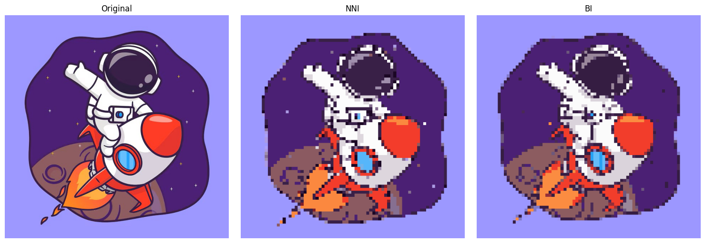

# Pixel Art Generator 🎨
_Uma aplicação web para geração de pixel art a partir de uma imagem de entrada._

---

## Sobre o Projeto 

### Contexto

A criação desse projeto surgiu durante a disciplina de Computação Visual no curso de Ciência da Computação. O objetivo era aplicar os conhecimentos adquiridos ao longo da disciplina para criar uma aplicação real. A ideia de criar um gerador de pixel art foi motivada por duas razões principais:

1. Aplicação clara de conceitos de computação visual, como interpolação e quantização de imagens. Além disso, para a conclusão integral do projeto, conceitos de desenvolvimento web também seriam essenciais.
2. _Pixel arts são lindas!_

---

### Tecnologias utilizadas

* **Python**: Linguagem principal do desenvolvimento.
* **Flask**: Estruturação completa do servidor da aplicação, em forma de API. Além de gerenciamento dos endpoints criados e redirecionamento de rotas do front-end.
* **HTML**: Estruturação completa do front-end da aplicação.
* **Bootstrap**: Estilização das páginas HTML.
* **Jupyter Notebook**: utilizado para validar os algoritmos desenvolvidos antes de implementá-los na nossa API.

---

### Algoritmos utilizados

#### Interpolação

Para a criação de um efeito de pixel art nas imagens de entrada, foram utilizados dois algoritmos diferentes de interpolação: o _**Nearest Neighbor Interpolation (NNI)**_ e o _**Bilinear Interpolation (BI)**_. O que foi observado durante os testes, é que os dois algoritmos, em alguns casos, chegam a resultados bem diferentes. Por vezes, a NNI gerava pixel arts mais bonitas e detalhadas e, em outros casos, a BI acabava tendo resultados melhores. É por isso que nessa primeira versão do gerador, nós oferecemos ao usuário duas opções de download de pixel art. Para futuras versões, é planejado que obtenhamos um algoritmo de interpolação que consiga extrair o que há de melhor na NNI e na BI, para gerar um resultado único.

#### Quantização

Para a diminuição da paleta de cores da aplicação nós utilizamos um algoritmo KMeans, que seleciona as principais cores da imagem limitado a um valor especificado pelo usuário. O valor mínimo recomendado é 16, visto que valores inferiores podem fazer com que a imagem perca muitos detalhes. Abaixo é possível observar o efeito do algoritimo de quantização diminuindo a paleta de cores de uma imagem que possui um gradiente de cores.

---

### Como executar?

#### Pré-requisitos

* **Python 3.9+**: Certifique-se de que o Python esteja instalado em seu sistema.
* **Gerenciador de pacotes pip**: Geralmente já vem com a instalação do Python.

#### 1º Clone o projeto

<pre><code>git clone https://github.com/omgitsgm/pixel-art-generator.git</code></pre>

#### 2º Instale as dependências

Certifique-se de que está no diretório do projeto e execute:

<pre><code>pip install -r requirements.txt</code></pre>

#### 3º Execute o servidor Flask

Certifique-se de que todas as dependências foram instaladas corretamente e execute:

<pre><code>python main.py</code></pre>

O servidor estará disponível em http://127.0.0.1:5000.

---

### Como usar?

1. Acesse a página inicial: http://127.0.0.1:5000.
2. Faça upload de uma imagem usando o formulário.
3. Escolha o tamanho da paleta de cores (opcional).
4. Clique em "Submit" para processar a imagem.
5. Você será redirecionado para uma página onde poderá visualizar e fazer o download das imagens processadas.
6. Você pode retornar para a página inicial e realizar o upload de novas imagens clicando no mago no topo do site.

---

### Telas do Sistema

### Tela inícial

### Tela de visualização das imagens convertidas

---

### Exemplos de saída

Aqui estão alguns exemplos de resultados de criação de pixel art que podem ser obtidos ao usar a aplicação. Foi disponibilizada uma pasta com algumas [_**Imagens Recomendadas**_](https://github.com/omgitsgm/pixel-art-generator/tree/main/recommended-images) para teste. Essas imagens chegam a resultados muito bonitos de conversão e por isso foram selecionadas. Você também pode testar a aplicação com imagens próprias, mas é recomendado que elas tenham uma resolução de até 700x700 e sejam imagens de ilustrações simples. Os resultados para imagens muito complexas pode não atingir os resultados esperados. 

